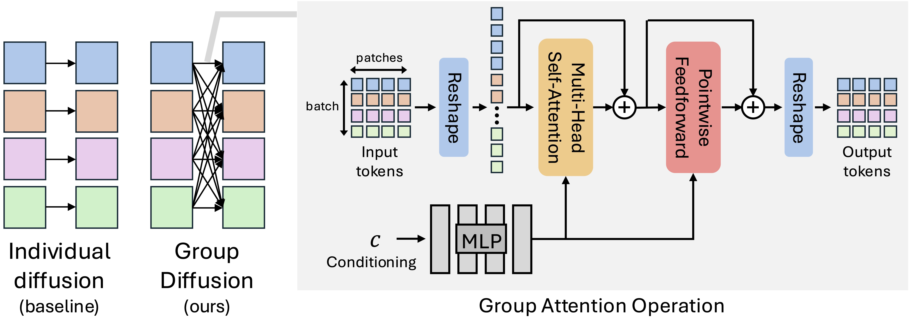

> ## Group Diffusion: Enhancing Image Generation by Unlocking Cross-Sample Collaboration
> ### [[Paper]]() [[Project Page]](https://sichengmo.github.io/GroupDiff/) <br>
> <div class="authors">
> <a href="https://sichengmo.github.io/" target="_blank">Sicheng Mo</a><sup>1</sup>, 
> <a href="https://thaoshibe.github.io/" target="_blank">Thao Nguyen</a><sup>2</sup>, 
> <a href="https://richzhang.github.io/" target="_blank">Richard Zhang</a><sup>3</sup>, 
> <a href="https://home.ttic.edu/~nickkolkin/home.html" target="_blank">Nicholas Kolkin</a><sup>3</sup>, 
> <a href="https://scholar.google.com/citations?user=7uTobWwAAAAJ&hl=en" target="_blank">Siddharth Srinivasan Iyer</a><sup>3</sup>, 
> <a href="https://research.adobe.com/person/eli-shechtman/" target="_blank">Eli Shechtman</a><sup>3</sup>, 
> <a href="https://krsingh.cs.ucdavis.edu/" target="_blank">Krishna Kumar Singh</a><sup>3</sup>, 
> <a href="https://pages.cs.wisc.edu/~yongjaelee/" target="_blank">Yong Jae Lee</a><sup>2</sup>, 
> <a href="https://boleizhou.github.io/" target="_blank">Bolei Zhou</a><sup>1</sup>, 
> <a href="https://yuheng-li.github.io/" target="_blank">Yuheng Li</a><sup>3</sup>
> </div>
> <div class="affiliations">
> <sup>1</sup>UCLA &nbsp;&nbsp; <sup>2</sup>UW-Madison &nbsp;&nbsp; <sup>3</sup>Adobe
> </div>
<p align="center">
  
</p>

## Overview

This is the official implementation of Group Diffusion, a Generative AI algorithm for enhancing image generation via cross-sample attention.


## Preparation

### Installation 

Download the code:  (example, please update it)
```bash
git clone https://github.com/adobe-research/GroupDiff.git
cd GroupDiff
```

Create and activate conda environment:
```bash
conda create -n gdiff python=3.10 -y && conda activate gdiff
pip install -r requirements.txt
pip install 'tensorflow[and-cuda]'
```

### Dataset
Download the [ImageNet](https://image-net.org/download) dataset, and place it in under `data/imagenet/`.


After that, run the following script to extract VAE latent and embedding for each images.
```bash
mkdir data
# Download / link imagenet train to data/imagenet
ln -s YOUR_IMAGENET_PATH data/imagenet

torchrun --nnodes=1 --nproc_per_node=8 dataset/extract_feats.py \
    --data-path data/imagenet/imagenet/train \
    --features-path data/imagenet_feats/train \
    --models all
```

Then, create FAISS index for fast similarity search during training (this will take around 30 minutes):
```bash 
python dataset/create_fasiss.py \
    --metadata data/imagenet_feats/train/metadata.json \
    --feature_key dinov2-l \
    --output_dir data/imagenet_feats/train_index/dinov2-l \
    --index_type ivfpq \
    --num_workers 32
```

This will create a FAISS index from the extracted DINOv2-L features, which enables efficient nearest neighbor search during GroupDiff training. The `ivfpq` index type provides a good balance between search speed and memory usage.


## Models 
| Model                       | Resume From | Pre-Training Iters | Fine-tuning Iters | Link |
|-----------------------------|-------------|--------------------|-------------------|------|
| GroupDiff-l-4 (SiT-XL)      | REPA-SiT    | 4M                 | 500K              | [ckpt](https://huggingface.co/Sichengmo/GroupDiff/blob/main/gdiff-l-4-sit-xl-2-repa-resume.pth) |
| GroupDiff-l-4 (DiT-XL)      | REPA-SiT    | 4M                 | 500K              | [ckpt](https://huggingface.co/Sichengmo/GroupDiff/blob/main/gdiff-l-4-dit-xl-2-resume.pth) |

Run the following script to download our pre-trained checkpoints and FID stats file (from [ADM's TensorFlow
evaluation suite](https://github.com/openai/guided-diffusion/tree/main/evaluations)).  

```
huggingface-cli download Sichengmo/GroupDiff --local-dir released_model

wget https://openaipublic.blob.core.windows.net/diffusion/jul-2021/ref_batches/imagenet/256/VIRTUAL_imagenet256_labeled.npz -O data/VIRTUAL_imagenet256_labeled.npz

```

## Training
Detailed scripts for GroupDiff training can be found in [`scripts/`](scripts/).


### 1. GroupDiff-l Training 
Train GroupDiff-l with DiT-XL (800 epochs):
```bash 
project=GroupDiff
exp_name=groupdiff-l-4-dit-xl-dinov2
batch_size=32  # per GPU batch size, global batch size = batch_size x num_gpus = 32 x 8 = 256
epochs=800
YOUR_WANDB_ENTITY="YourWandbEntity"

accelerate launch --num_processes 8 --multi_gpu --mixed_precision=bf16 train.py \
    --project $project --exp_name $exp_name --auto_resume \
    --model DiT_xl --patch_size 2 --num_max_sample 4 \
    --batch_size $batch_size --epochs $epochs \
    --lr 1e-4 --num_sampling_steps 250 \
    --data_path data/imagenet/train \
    --query_sim feat --use_cached_tokens \
    --entity $YOUR_WANDB_ENTITY
```

**Optional: Using Custom Feature Paths**

Then add these arguments to specify custom paths:
```bash
--metadata_path data/imagenet_feats/train/metadata.json \
--faiss_index_path data/imagenet_feats/train_index/dinov2-l/imagenet_index_ivfpq.faiss \
--faiss_feature_name "dinov2-l" \
--features_root data/imagenet_feats/train \
--load_latent \
--latent_feature_name "vae-256" \
--latent_root data/imagenet_feats/train
```


Train GroupDiff-l with SiT-XL (800 epochs):
```bash 
project=GroupDiff
exp_name=groupdiff-l-4-sit-xl-dinov2
batch_size=32  # per GPU batch size, global batch size = batch_size x num_gpus = 32 x 8 = 256
epochs=800
YOUR_WANDB_ENTITY="YourWandbEntity"

accelerate launch --num_processes 8 --multi_gpu --mixed_precision=bf16 train.py \
    --project $project --exp_name $exp_name --auto_resume \
    --model SiT_xl --patch_size 2 --num_max_sample 4 \
    --batch_size $batch_size --epochs $epochs \
    --lr 1e-4 --num_sampling_steps 250 \
    --data_path data/imagenet/train \
    --query_sim feat --use_cached_tokens \
    --entity $YOUR_WANDB_ENTITY
```


## Evaluation (ImageNet 256x256)
### Evaluate GroupDiff-l-4 with DiT-XL
```bash
checkpoint_path=work_dirs/${project}/${exp_name}/checkpoints/lastest.pth
accelerate launch --num_processes 8 --multi_gpu --mixed_precision=bf16 eval.py \
    --project $project --exp_name $exp_name --auto_resume \
    --model DiT_base --patch_size 2 --num_max_sample 4 \
    --batch_size $batch_size --eval_bsz 128 \
    --num_sampling_steps 250 --cfg 2.5 \
    --guidance_low 0.0 --guidance_high 1.0 \
    --cond_group_size 1 --uncond_group_size 4 \
    --num_images 50000 --seed 0 \
    --load_from ${checkpoint_path} --use_ema \
    --fid_stats_path data/VIRTUAL_imagenet256_labeled.npz \
    --entity $YOUR_WANDB_ENTITY
```

### Evaluate Pre-trained GroupDiff-l-4 with DiT-XL 
```bash
project=GroupDiff-l-pretrained
exp_name=gdiff-l-4-dit-xl-2-resume
checkpoint_path=released_model/${exp_name}.pth
batch_size=32  # per GPU batch size
YOUR_WANDB_ENTITY="YourWandbEntity"

accelerate launch --num_processes 8 --multi_gpu --mixed_precision=bf16 eval.py \
    --project $project --exp_name $exp_name --auto_resume \
    --model DiT_xl --patch_size 2 --num_max_sample 4 \
    --batch_size $batch_size --eval_bsz 128 \
    --num_sampling_steps 250 --cfg 1.65 \
    --guidance_low 0.0 --guidance_high 1.0 \
    --cond_group_size 1 --uncond_group_size 4 \
    --num_images 50000 --seed 0 \
    --load_from ${checkpoint_path} --use_ema \
    --fid_stats_path data/VIRTUAL_imagenet256_labeled.npz \
    --entity $YOUR_WANDB_ENTITY
```

    
### Evaluate Pre-trained GroupDiff-l-4 with SiT-XL 
```bash
project=GroupDiff-l-pretrained
exp_name=gdiff-l-4-sit-xl-2-repa-resume
checkpoint_path=released_model/${exp_name}.pth
batch_size=32  # per GPU batch size
YOUR_WANDB_ENTITY="YourWandbEntity"

accelerate launch --num_processes 8 --multi_gpu --mixed_precision=bf16 eval.py \
    --project $project --exp_name $exp_name --auto_resume \
    --model SiT_xl --patch_size 2 --num_max_sample 4 \
    --batch_size $batch_size --eval_bsz 128 \
    --num_sampling_steps 250 --cfg 2.585 \
    --guidance_low 0.25 --guidance_high 0.75 \
    --cond_group_size 1 --uncond_group_size 4 \
    --num_images 50000 --seed 0 \
    --load_from ${checkpoint_path} --use_ema \
    --fid_stats_path data/VIRTUAL_imagenet256_labeled.npz \
    --entity $YOUR_WANDB_ENTITY
```


## Acknowledgements
We thank the authors of [DiT](https://github.com/facebookresearch/DiT), and [SiT](https://github.com/LTH14/mar) for their foundational work.

Our codebase builds upon several excellent open-source projects, including [DeTok](https://github.com/Jiawei-Yang/DeTok) and [MAR](https://github.com/LTH14/mar). We are grateful to the communities behind them.


## Contact
[Sicheng Mo](https://sichengmo.github.io/) (smo3@cs.ucla.edu)

This codebase has been cleaned up but has not undergone extensive testing. If you encounter any issues or have questions, please open a GitHub issue. We appreciate your feedback!